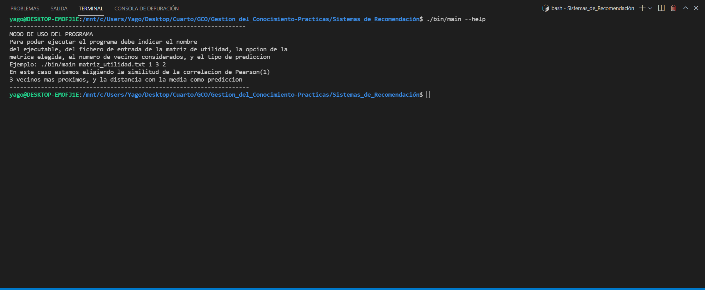
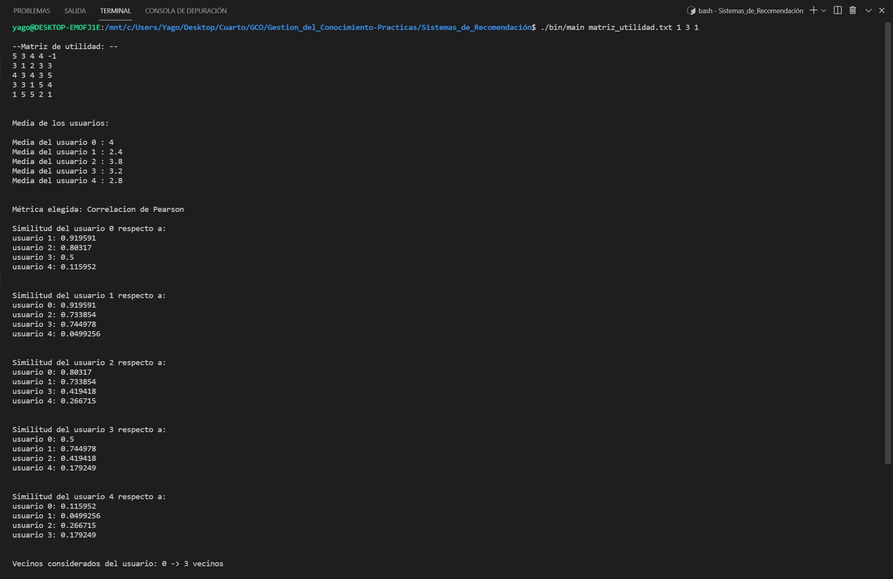
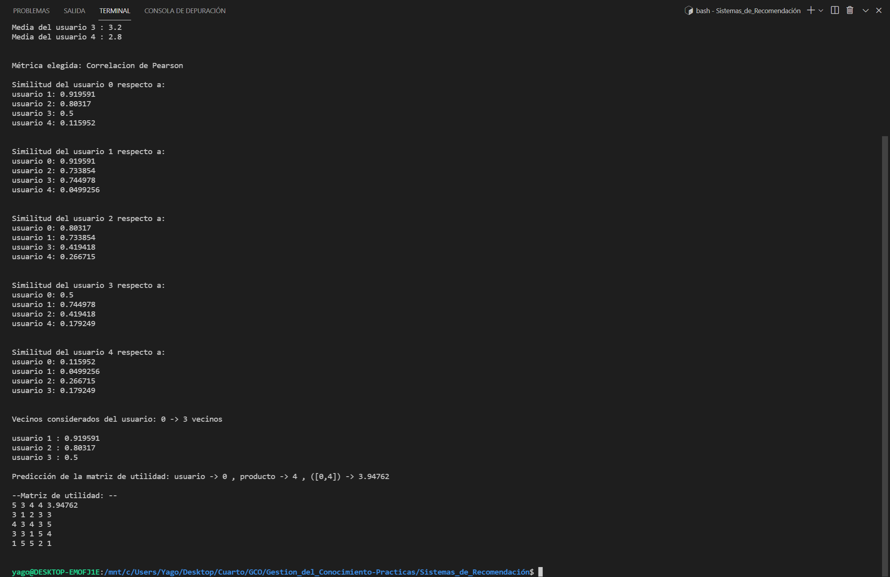

# **Gestion_del_Conocimiento-Practicas**
En este repositorio se alojan las prácticas de la asignatura Gestión del Conocimiento para las Organizaciones

## **Sistemas de Recomendación**
Dentro del directorio **Sistemas_de_Recomendacion** se encuentra la estructura de directorios que da forma a la
resolución de la práctica, dentro de la misma nos encontramos:

1.  Directorio */bin*: donde se encuentra el archivo ejecutable
2.  Directorio */examples*: donde se encuentran ejemplos de matrices de utilidad
3.  Directorio */include*: donde se encuentra la especificacion de clases de C++
4.  Directorio */src*: donde se encuentra la implementación de clases de C++

Para la resolución de la práctica se ha usado el lenguaje C++, y para ello se dispone de una única clase, que alberga
todos los elementos necesarios para el sistema recomendador, mientras que el programa principal, *main.cc*, hace uso como
cliente de esta clase.

La clase Matrix, que definimos tiene como principal atributo, una matriz de numeros con la que el programa hace operaciones
sobre la misma, el programa principal es quien maneja los errores que pueda causar el usuario con los argumentos.

Como comentamos la clase también se encarga de crear la matriz propiamente dicha, leerla, y en base a los valores nulos
que el usuario ha especificado en el fichero de especificación de la matriz de utilidad, realiza los calculos, primero, 
las similitudes de un usuario con el resto de usuarios en base a una métrica elegida.

Posteriormente, el calculo de las predicciones en base a la opcion que el usuario haya escogido, principalmente el objetivo
es que se puedan predecir unos valores que el usuario todavia no ha proporcionado a un item especifico, en base a las valoraciones
de usuarios parecidos.

Todos estas funcionalidades se describen como métodos de la clase *Matrix*, otro aspecto interesante que merece la pena destacar es que
hacemos uso de una estructura de datos en C++ denominada *map*, que lo que hace básicamente es guardar elementos como parejas de *clave-valor*
en este caso, la clave sería un *pair*, con los usuarios *a-b*, y el valor sería un *double*, que correspondería con el valor de la similitud
del usuario a con el usuario b, será diferente en función de la métrica que hayamos escogido, también tenemos otro *map* para el cálculo de las 
predicciones.

Uno de los métodos de la clase que merece la pena resaltar es el siguiente:

```C++
bool Matrix::es_nulo(int i, int j) {
  if (matriz[i][j] == -1.0) { 
    return true;
  } else {
    return false;
  }
}
```
Su función es la de comprobar que un elemento es nulo, en el fichero de especificación de la matriz los elementos nulos están representados como
un guión,sin embargo para el programa los toma como un número negativo para que sea más fácil trabajar con el.

También hay un método por cada métrica considerada, *similitud_pearson*, *similitud_euclidea*, y *similitud_coseno*, así como para las
predicciones, *prediccion_simple*, *diferencia_con_la_media*.

Una vez tenemos los valores y los hemos guardado en el map, este llama a un método auxiliar que completa la matriz.

```C++
void Matrix::completar_matriz() {
  for (int i = 0; i < get_filas(); i++) {
    for (int j = 0; j < get_columnas(); j++) {
      if (es_nulo(i, j)) {
        matriz[i][j] = valores_completar[{i, j}];
      }
    }
  }
}
```

Si se desea ver más a fondo todos los métodos, se ha comentado cada aspecto del programa con *doxygen*, dentro del código fuente.
### **Ejemplo de Uso del Programa**
El programa necesita **5 argumentos** para poder ejecutarse correctamente, si se especifica la opción --help, éste funciona como un
comando de Linux y le proporciona una descripción breve del uso del programa:



Estos argumentos como vemos tienen que ser: (Todo esto dentro del directorio ***Sistemas_de_Recomendación***)

1.  Fichero ejecutable, en este caso es *./bin/main*
2.  Fichero de especificacion de las matrices de utilidad, en este caso dentro del directorio ./examples/
3.  Metrica considerada: (1)Correlación de Pearson, (2)Distancia Coseno, (3)Distancia Euclídea
4.  Número de vecinos considerado
5.  Método de predicción elegida: (1)Predicción simple, (2)Diferencia con la media.

En la siguiente captura se muestra un ejemplo de ejecución, con la matriz del guión de la práctica, (este fichero lo hemos colocado
en el propio directorio de la práctica, no dentro de */examples*):



